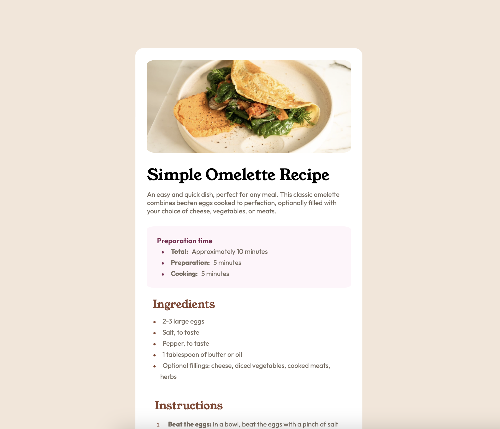
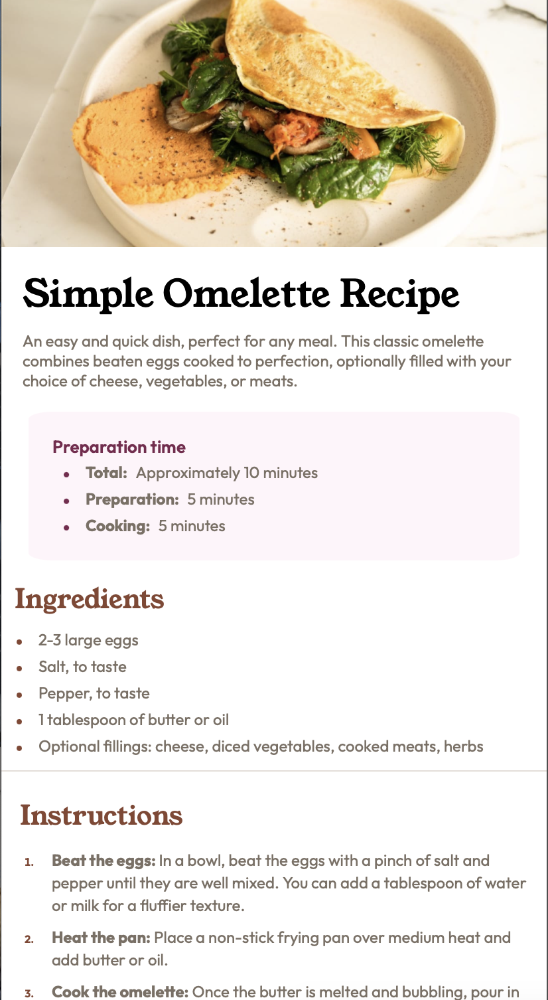

# Frontend Mentor - Recipe page solution

This is a solution to the [Recipe page challenge on Frontend Mentor](https://www.frontendmentor.io/challenges/recipe-page-KiTsR8QQKm). Frontend Mentor challenges help you improve your coding skills by building realistic projects. 

## Table of contents

- [Overview](#overview)
  - [The challenge](#the-challenge)
  - [Screenshot](#screenshot)
  - [Links](#links)
- [My process](#my-process)
  - [Built with](#built-with)
  - [What I learned](#what-i-learned)
  - [Continued development](#continued-development)
  - [Useful resources](#useful-resources)
- [Author](#author)

## Overview

### Screenshot





### Links

- Live Site URL: [recipe-page-main](https://sar-mko.github.io/recipe-page-main/)

## My process

### Built with

- Semantic HTML5 markup
- CSS custom properties
- Flexbox
- HTML Table

### What I learned

Learned a bit working on the table and how they work, and what designing them looks like. Took away border-spacing to match to the original image.

```css
table{
    width: 100%;
    border-spacing: 0;
    padding: 8px;
}
```

### Continued development

Want to try practicing grid, so will try re-building this project or similar ones with it.

### Useful resources

- [MDN](https://developer.mozilla.org/en-US/docs/Web/CSS) - The MDN helped a lot with revisting pseudoclasses and sibling combinators to adding target styles for the table. 

## Author

- Github - [Sarah](https://github.com/sar-mko)
- Frontend Mentor - [@sar-mko](https://www.frontendmentor.io/profile/sar-mko)
